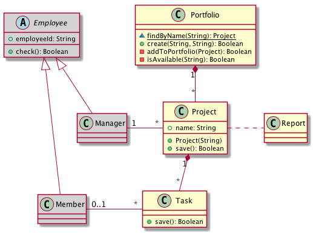
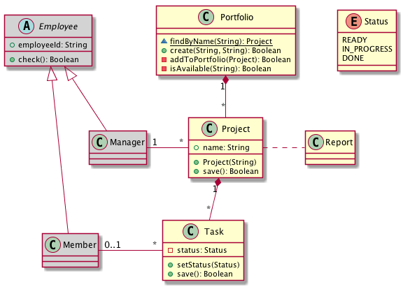
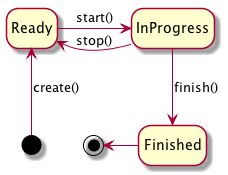
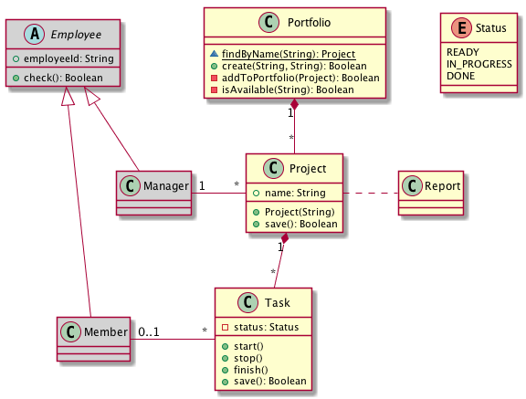
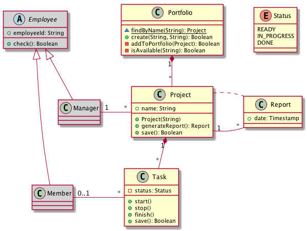
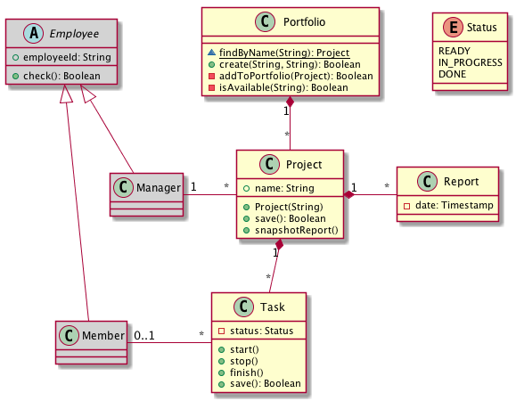

# Object-oriented Design Kata

  * Author: Sébastien Mosser
  * Reviewer: Philippe Collet
  * Version: 2018.10

## Context

## Initial Use Case Diagram

  

## Domain Model

### Vocabulary

  

### Structural Model

  

### Updated Use case diagram

  

## Introducing a feature: Create a new project

### Best case sequence modelling

  

### Checking name availability, technical version

  

### Checking name availability, domain version

  

### Associated Class diagram

## Introducing a feature: Make progress on a task

### Technical class diagram

  

### State diagram

  

### Domain-driven Class diagram

  

## Introducing a feature: Generate a Report

### Version #1: transient reports

  

### Version #2: updatable report

  

### Version #3: report with history

  
