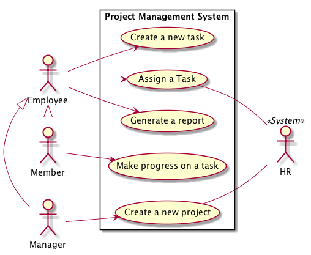

# Object-oriented Design Kata

  * Author: Sébastien Mosser
  * Reviewer: Philippe Collet
  * Version: 2018.10

## Context

## Initial Use Case Diagram

  

## Domain Model

### Vocabulary

  

### Structural Model

  

### Updated Use case diagram

  

## Introducing a feature: Create a new project

### Best case sequence modelling

  

### Checking name availability

  

### Checking name availability, business version

  
